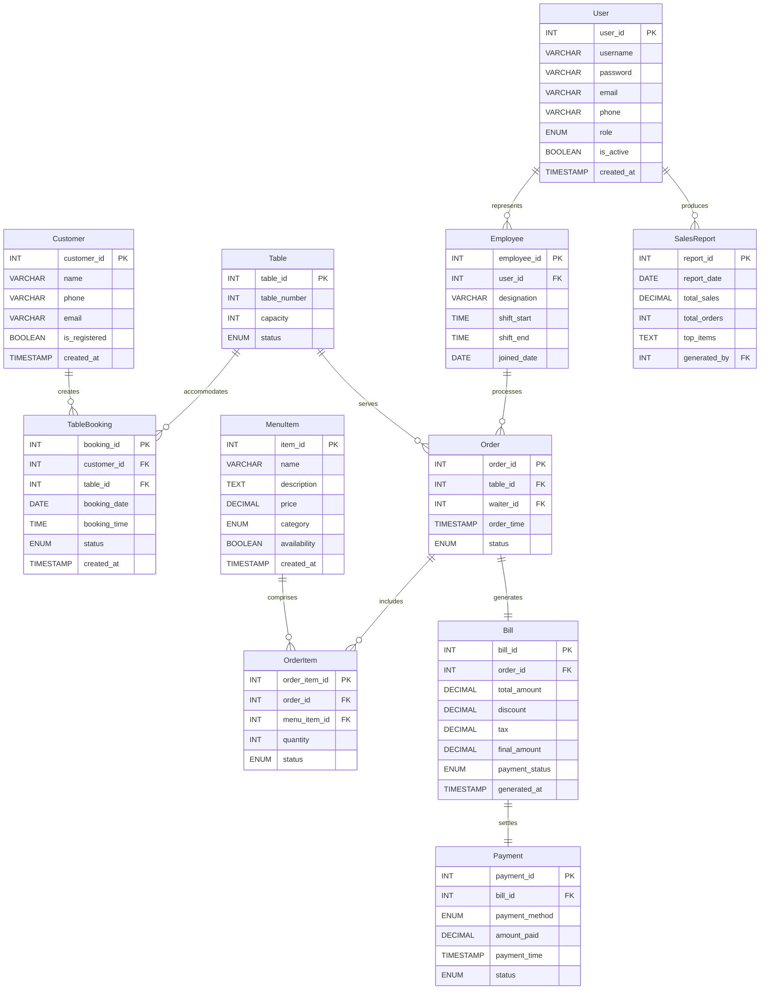
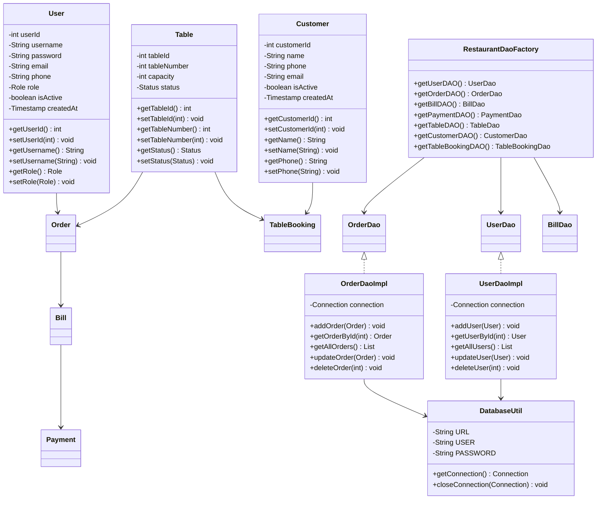
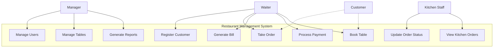
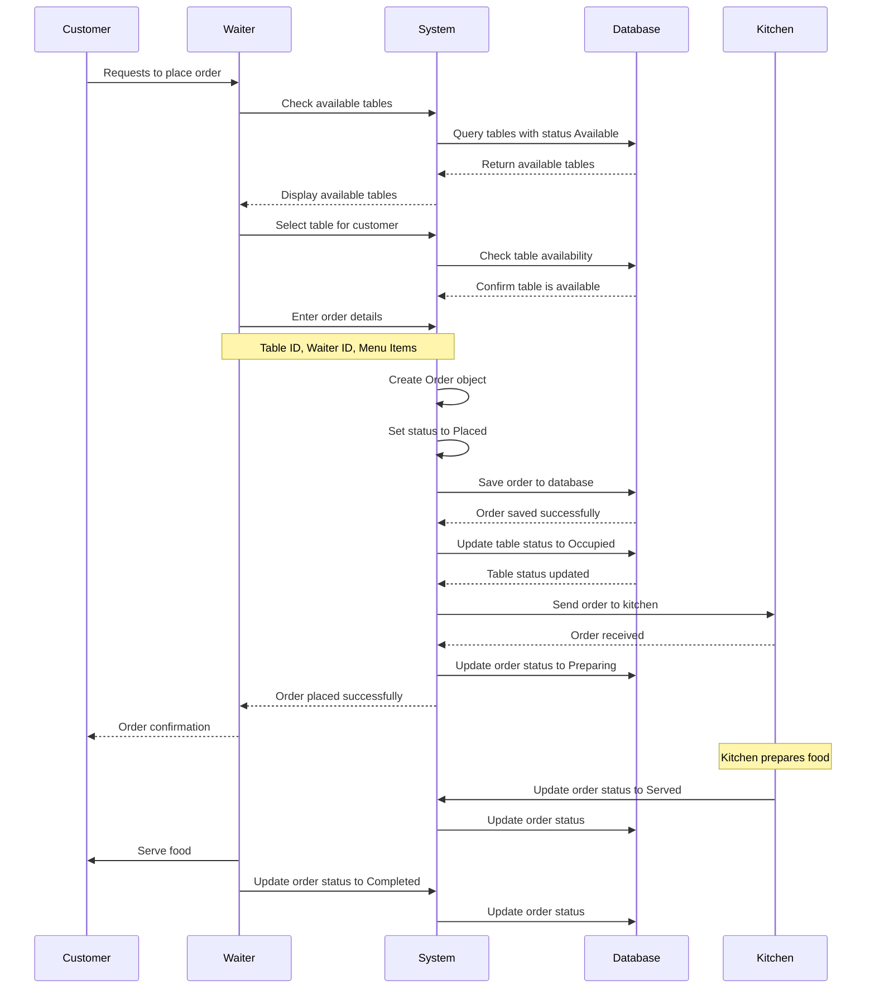
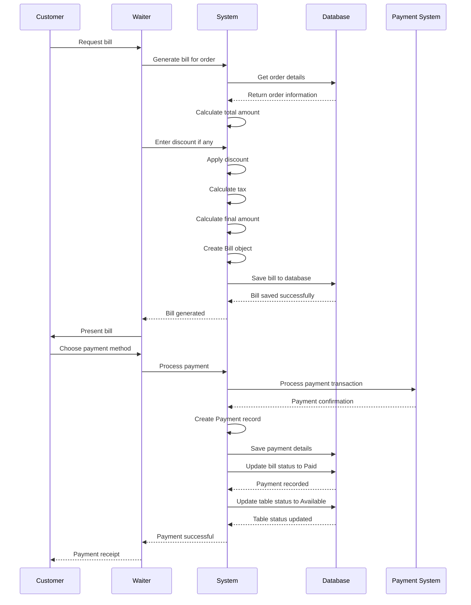
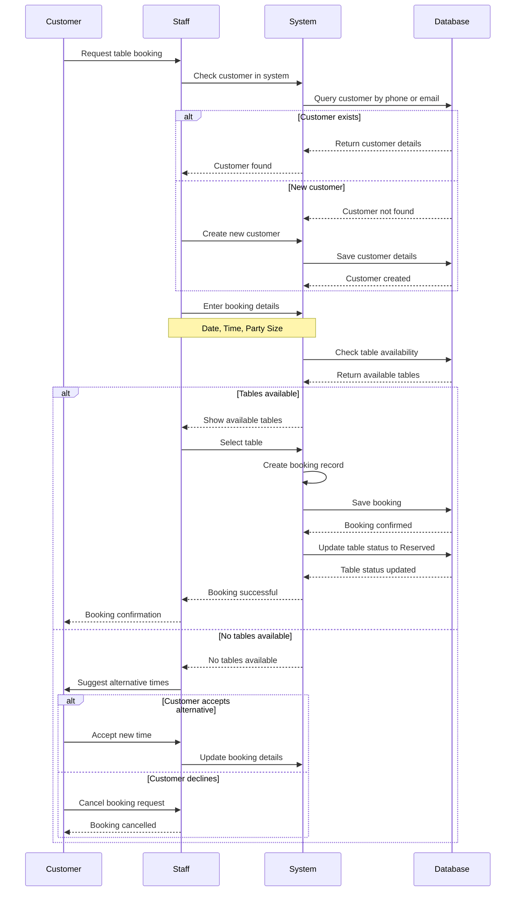
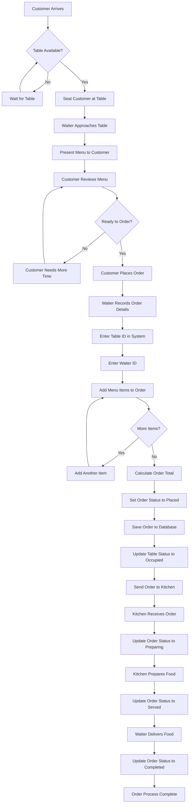
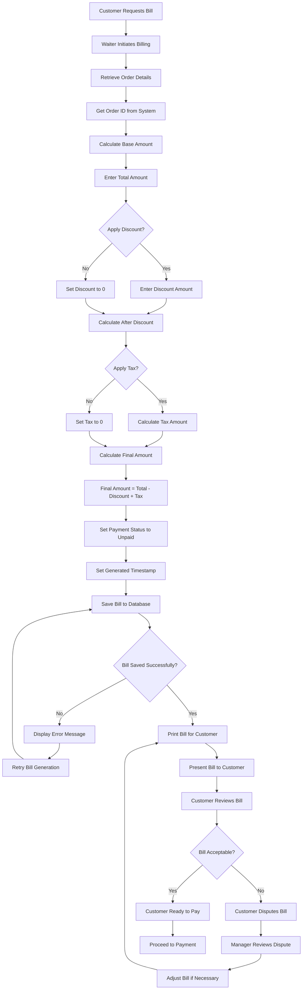
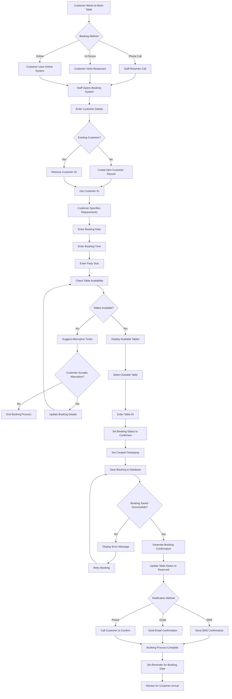

# Restaurant Management System

A robust Java-based restaurant management solution leveraging JDBC and PostgreSQL technologies, delivering comprehensive functionality for order processing, billing operations, table reservations, and customer relationship management.

## ✨ Key Features

### Primary Capabilities
- **User Administration**: Role-based authentication system supporting Managers, Waiters, and Kitchen Personnel
- **Customer Relations**: Complete customer registration and profile administration
- **Table Operations**: Dynamic table allocation with real-time status monitoring and capacity oversight
- **Order Processing**: End-to-end order lifecycle management from initial placement through completion
- **Financial Management**: Automated invoice generation incorporating tax calculations and discount applications
- **Transaction Processing**: Multi-channel payment acceptance (Cash, Card, UPI, Digital Wallet)
- **Reservation System**: Advanced table booking with comprehensive date/time scheduling
- **Analytics Dashboard**: Comprehensive sales reporting and business intelligence

### Technical Architecture
- **Data Access Layer**: Implements DAO pattern for clean data abstraction
- **Business Logic**: Dedicated service layer for application logic separation
- **Object Creation**: Factory pattern implementation for centralized DAO instantiation
- **Database Integration**: Seamless PostgreSQL connectivity and transaction management
- **User Interface**: Interactive command-line interface with intuitive navigation

## �️ System Architecture

The application employs a sophisticated layered architecture approach:

```
src/main/java/org/example/
├── model/              # Domain entities (User, Customer, Order, etc.)
├── dao/               # Data persistence layer
│   ├── interfaces/    # Contract definitions for data access
│   └── impl/          # Concrete DAO implementations
├── service/           # Application business logic
│   ├── interfaces/    # Service contract definitions
│   └── impl/          # Business logic implementations
├── controller/        # Presentation layer controllers
├── util/              # System utilities (DatabaseUtil)
└── Main.java          # Application bootstrap
```

## 📋 System Requirements

- **Java Runtime**: Version 17 or later
- **Database**: PostgreSQL 12 or later
- **Build Tool**: Maven 3.6 or later

## � Installation Guide

### 1. Repository Setup
```bash
git clone <repository-url>
cd restaurant-management-system
```

### 2. Database Configuration

Initialize PostgreSQL database with required schema:

```sql
-- Database creation
CREATE DATABASE restaurant_management;

-- Schema initialization
\c restaurant_management;

-- User accounts table
CREATE TABLE users (
    user_id SERIAL PRIMARY KEY,
    username VARCHAR(50) UNIQUE NOT NULL,
    password VARCHAR(100) NOT NULL,
    email VARCHAR(100) UNIQUE NOT NULL,
    phone VARCHAR(15),
    role VARCHAR(20) NOT NULL,
    is_active BOOLEAN DEFAULT true,
    created_at TIMESTAMP DEFAULT CURRENT_TIMESTAMP,
    updated_at TIMESTAMP DEFAULT CURRENT_TIMESTAMP
);

-- Customer registry table
CREATE TABLE customers (
    customer_id SERIAL PRIMARY KEY,
    name VARCHAR(100) NOT NULL,
    phone VARCHAR(15),
    email VARCHAR(100) UNIQUE,
    is_active BOOLEAN DEFAULT true,
    created_at TIMESTAMP DEFAULT CURRENT_TIMESTAMP,
    updated_at TIMESTAMP DEFAULT CURRENT_TIMESTAMP
);

-- Restaurant tables registry
CREATE TABLE tables (
    table_id SERIAL PRIMARY KEY,
    table_number INTEGER UNIQUE NOT NULL,
    capacity INTEGER NOT NULL,
    status VARCHAR(20) DEFAULT 'Available',
    created_at TIMESTAMP DEFAULT CURRENT_TIMESTAMP,
    updated_at TIMESTAMP DEFAULT CURRENT_TIMESTAMP
);

-- Order tracking table
CREATE TABLE orders (
    order_id SERIAL PRIMARY KEY,
    table_id INTEGER REFERENCES tables(table_id),
    waiter_id INTEGER REFERENCES users(user_id),
    order_time TIMESTAMP DEFAULT CURRENT_TIMESTAMP,
    status VARCHAR(20) DEFAULT 'Placed',
    total_amount DECIMAL(10,2),
    created_at TIMESTAMP DEFAULT CURRENT_TIMESTAMP,
    updated_at TIMESTAMP DEFAULT CURRENT_TIMESTAMP
);

-- Billing information table
CREATE TABLE bills (
    bill_id SERIAL PRIMARY KEY,
    order_id INTEGER REFERENCES orders(order_id),
    total_amount DECIMAL(10,2) NOT NULL,
    discount DECIMAL(10,2) DEFAULT 0,
    tax DECIMAL(10,2) DEFAULT 0,
    final_amount DECIMAL(10,2) NOT NULL,
    payment_status VARCHAR(20) DEFAULT 'Unpaid',
    generated_at TIMESTAMP DEFAULT CURRENT_TIMESTAMP,
    updated_at TIMESTAMP DEFAULT CURRENT_TIMESTAMP
);

-- Payment transactions table
CREATE TABLE payments (
    payment_id SERIAL PRIMARY KEY,
    bill_id INTEGER REFERENCES bills(bill_id),
    amount_paid DECIMAL(10,2) NOT NULL,
    payment_method VARCHAR(20) NOT NULL,
    transaction_id VARCHAR(100),
    payment_time TIMESTAMP DEFAULT CURRENT_TIMESTAMP,
    status VARCHAR(20) DEFAULT 'Successful'
);

-- Reservation management table
CREATE TABLE table_bookings (
    booking_id SERIAL PRIMARY KEY,
    customer_id INTEGER REFERENCES customers(customer_id),
    table_id INTEGER REFERENCES tables(table_id),
    booking_date DATE NOT NULL,
    booking_time TIME NOT NULL,
    party_size INTEGER,
    status VARCHAR(20) DEFAULT 'Confirmed',
    special_requests TEXT,
    created_at TIMESTAMP DEFAULT CURRENT_TIMESTAMP,
    updated_at TIMESTAMP DEFAULT CURRENT_TIMESTAMP
);
```

### 3. Database Connection Setup

Configure database credentials in `src/main/java/org/example/util/DatabaseUtil.java`:

```java
private static final String URL = "jdbc:postgresql://localhost:5432/restaurant_management";
private static final String USER = "your_username";
private static final String PASSWORD = "your_password";
```

### 4. Application Deployment

```bash
# Project compilation
mvn clean compile

# Application execution
mvn exec:java -Dexec.mainClass="org.example.Main"
```

## � Application Usage

### Primary Navigation Menu

Upon application launch, the following options are presented:

```
=== Restaurant Management System ===
1. User Management
2. Customer Management
3. Table Management
4. Order Management
5. Bill Management
6. Payment Management
7. Table Booking Management
8. Exit
```

### Operational Workflows

#### 1. Initial System Configuration
```
1. Configure User Accounts (Manager, Waiters, Kitchen Personnel)
2. Initialize Table Configuration (table numbers and seating capacity)
3. Register Customer Database (customer profile creation)
```

#### 2. Order Processing Pipeline
```
1. Customer arrival → Verify table availability
2. Customer seating → Waiter assignment
3. Order placement → Status: "Placed"
4. Kitchen preparation → Status: "Preparing"
5. Food service → Status: "Served"
6. Order completion → Status: "Completed"
```

#### 3. Financial Processing Pipeline
```
1. Invoice generation for completed orders
2. Discount application and tax computation
3. Customer bill presentation
4. Payment processing (Cash/Card/UPI/Wallet)
5. Payment status confirmation
6. Table availability restoration
```

#### 4. Reservation Management Pipeline
```
1. Customer reservation request
2. Table availability verification for requested date/time
3. Booking record creation
4. Reservation confirmation
5. Table status update to "Reserved"
```

## 📊 Database Schema Overview

### Core Business Entities

- **Users**: System operators with designated roles (Manager, Waiter, KitchenStaff)
- **Customers**: Restaurant patrons and their contact information
- **Tables**: Physical restaurant tables with capacity and availability status
- **Orders**: Customer orders with comprehensive item tracking and status monitoring
- **Bills**: Financial documents with tax calculations and discount applications
- **Payments**: Transaction records supporting multiple payment channels
- **Table Bookings**: Advance reservations with comprehensive scheduling information

### Relationship Structure



## ⚙️ System Configuration

### Database Connection Properties
- Connection URL: `jdbc:postgresql://localhost:5432/restaurant_management`
- JDBC Driver: `org.postgresql.Driver`
- Connection Management: Basic pooling implementation

### Authorization and Access Control
- **Manager**: Complete system administration, user management, reporting capabilities
- **Waiter**: Order processing, customer service, billing operations
- **KitchenStaff**: Order status management, kitchen workflow operations

## 🎨 System Design Documentation

### Class Architecture



### Use Case Architecture



### Process Flow Documentation

#### Order Processing Sequence



#### Financial Processing Sequence



#### Reservation Management Sequence



### Activity Flow Documentation

#### Order Placement Workflow



#### Financial Processing Workflow



#### Reservation Management Workflow



---

**Engineered with precision for optimal restaurant operations**
